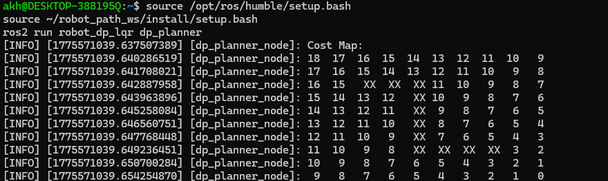
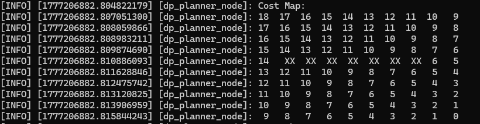
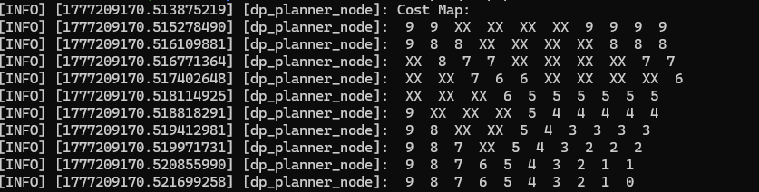
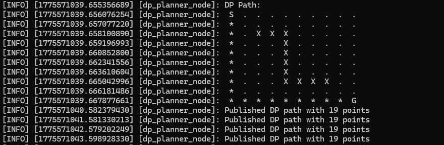
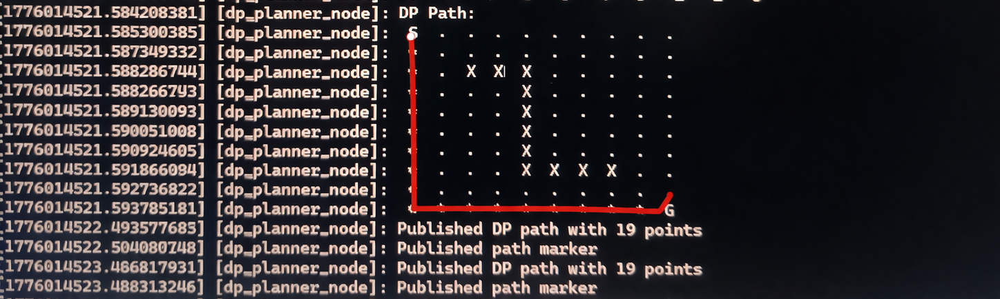
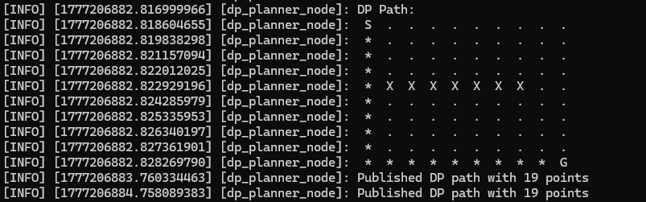
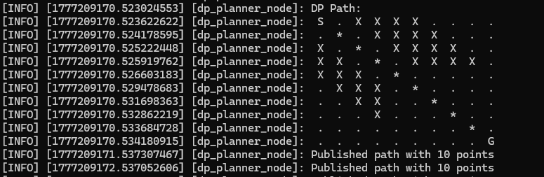
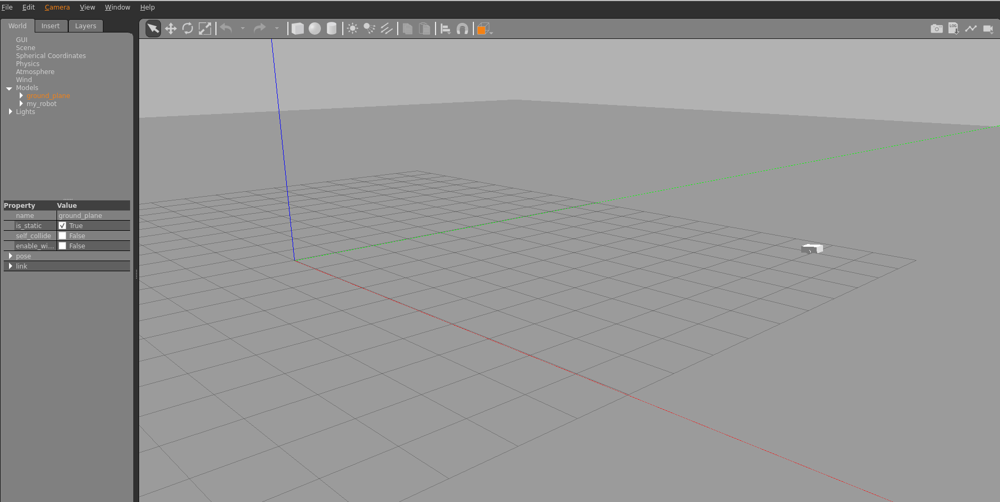
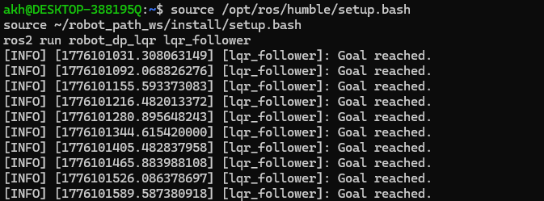

# Robot Path Planning using Dynamic Programming and LQR

## Robot Model View


---

# Overview

This project implements autonomous robot navigation using:

- Dynamic Programming (DP) for optimal path planning
- Linear Quadratic Regulator (LQR) for smooth trajectory tracking
- ROS2 Humble
- Gazebo Simulation Environment

The robot moves from a start position to a goal position while avoiding obstacles in a grid-based environment.

---

# Features

- Optimal path generation using Dynamic Programming
- Obstacle avoidance
- Smooth trajectory tracking using LQR
- Gazebo simulation support
- ROS2 node-based architecture
- Real-time odometry and velocity control

---

# Mathematical Background

## 1. Dynamic Programming Cost Function

Optimal cost function:

```math
J(s) = \min_{a} \left( c(s,a) + J(s') \right)
```

Where:
- `J(s)` = cost-to-go from the current state
- `c(s,a)` = movement cost
- `s'` = next state

---

## 2. Robot Kinematic Model

Robot motion equations:

```math
\dot{x} = v \cos(\theta)
```

```math
\dot{y} = v \sin(\theta)
```

```math
\dot{\theta} = \omega
```

Where:
- `v` = linear velocity
- `\omega` = angular velocity

---

## 3. LQR Cost Function

```math
J = \int_0^\infty (x^TQx + u^TRu)\,dt
```

Where:
- `Q` = state weighting matrix
- `R` = control weighting matrix

---

## 4. LQR Control Law

```math
u = -Kx
```

Where:
- `K` = optimal gain matrix
- `x` = state error vector

---

# Project Structure

```text
robot-path-planning-dp-lqr/
│
├── README.md
├── LICENSE
├── requirements.txt
│
├── docs/
│   └── images/
│
├── src/
├── urdf/
├── launch/
└── config/
```

---

# Project Images

## Dynamic Programming Cost Map


---

## DP Cost Map — Case 2


---

## DP Cost Map — Case 3


---

## Optimal Path Output


---

## Path Planning with Red Trajectory


---

## Path Planning — Case 2


---

## Path Planning — Case 3


---

## Gazebo Robot Simulation


---

## Gazebo Terminal Output


---

# Requirements

Install dependencies:

```bash
pip install -r requirements.txt
```

Main dependencies:

- numpy
- scipy
- matplotlib
- rclpy

---

# Running the Project

## Terminal 1 — Start Gazebo

```bash
source /opt/ros/humble/setup.bash
gazebo --verbose -s libgazebo_ros_init.so -s libgazebo_ros_factory.so
```

---

## Terminal 2 — Spawn Robot

```bash
source /opt/ros/humble/setup.bash
source ~/robot_path_ws/install/setup.bash

ros2 run gazebo_ros spawn_entity.py \
-file ~/robot_path_ws/src/robot_dp_lqr/urdf/simple_robot.urdf \
-entity my_robot
```

---

## Terminal 3 — Run DP Planner

```bash
source /opt/ros/humble/setup.bash
source ~/robot_path_ws/install/setup.bash

ros2 run robot_dp_lqr dp_planner
```

---

## Terminal 4 — Run LQR Controller

```bash
source /opt/ros/humble/setup.bash
source ~/robot_path_ws/install/setup.bash

ros2 run robot_dp_lqr lqr_follower
```

---

# Useful ROS2 Commands

## View Velocity Commands

```bash
ros2 topic echo /cmd_vel
```

---

## View Robot Odometry

```bash
ros2 topic echo /odom
```

---

## View Active Topics

```bash
ros2 topic list
```

---

# GitHub Upload Steps

## Initialize Git

```bash
git init
```

---

## Add Files

```bash
git add .
```

---

## Commit Files

```bash
git commit -m "Initial commit"
```

---

## Connect Repository

```bash
git remote add origin https://github.com/YOUR_USERNAME/YOUR_REPO.git
```

---

## Push to GitHub

```bash
git push -u origin main
```

---

# Authentication

When GitHub asks:

## Username

Enter:

```text
YOUR_GITHUB_USERNAME
```

---

## Password

Paste your GitHub Personal Access Token (PAT), not your GitHub password.

---

# Results

The robot:

- Plans an optimal path
- Avoids obstacles successfully
- Tracks the trajectory smoothly using LQR
- Reaches the goal position accurately

---

# Future Improvements

- SLAM integration
- Dynamic obstacle avoidance
- Reinforcement Learning
- MPC-based trajectory tracking
- Multi-robot coordination

---

# Author

Akhilesh Kumar Patel  
M.Tech, IIT Delhi

---

# License

This project is intended for academic and research purposes.
